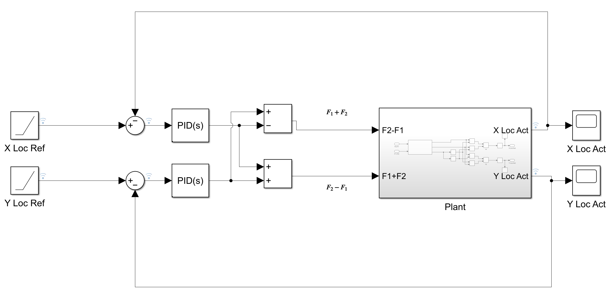
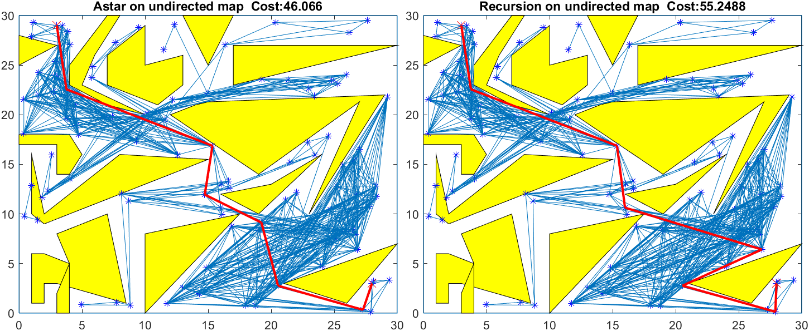

# ME390 Path Planning & Feedback Control for Robot Swimmer

## About

This REPO is based on the work of [Sampling-Based Mobile Robot Path Planning Algorithm by Dijkstra, Astar and Dynamic Programming](https://github.com/balcilar/RobotPathPlanning)

```
Yuanshao Yang
Email: yuanshao@umich.edu
Telegram: https://t.me/RobinY501
```

## Test Results

### Feedback Loop



### Steady State Error for the Ramp Response


## Route Planning


